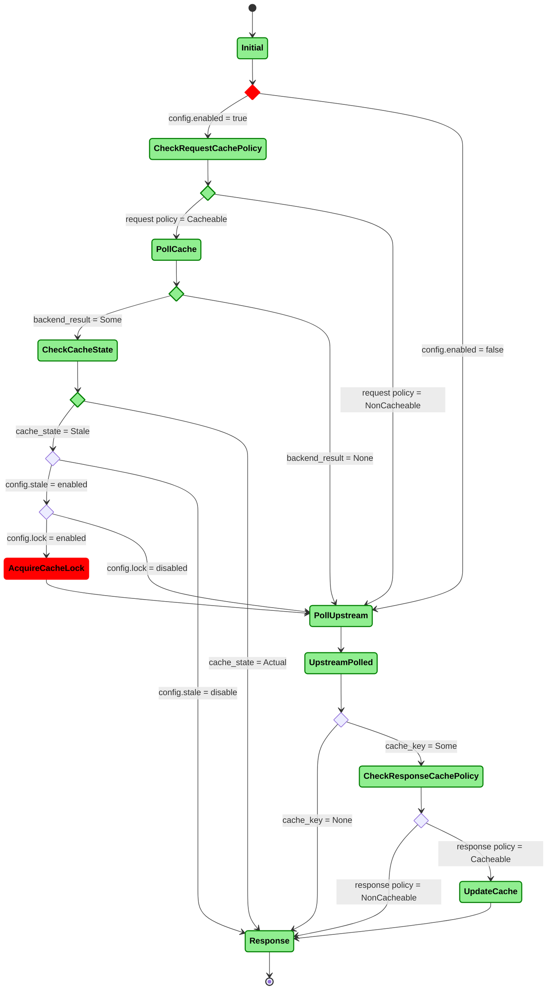

# Main cache flow diagram

```mermaid
 stateDiagram-v2
    classDef Implemented fill:lightgreen,color:black,font-weight:bold,stroke-width:2px,stroke:green
    classDef Unimplemented fill:red,color:black,font-weight:bold,stroke-width:2px,stroke:red
    class Initial Implemented
    class if_cache_enabled Unimplemented
    class CheckRequestCachePolicy Implemented
    class match_request_cache_policy Implemented
    class PollCache Implemented
    class check_backend_result Implemented
    class CheckCacheState Implemented
    class check_cache_state Implemented
    class Response Implemented
    class PollUpstream Implemented
    class UpstreamPolled Implemented
    class CheckResponseCachePolicy Implemented
    class UpdateCache Implemented
    class AcquireCacheLock Unimplemented

    state if_cache_enabled <<choice>>
    [*] --> Initial
    Initial --> if_cache_enabled
    if_cache_enabled --> CheckRequestCachePolicy: config.enabled = true
    if_cache_enabled --> PollUpstream: config.enabled = false

    state match_request_cache_policy <<choice>>
    CheckRequestCachePolicy --> match_request_cache_policy
    match_request_cache_policy --> PollCache: request policy = Cacheable
    match_request_cache_policy --> PollUpstream: request policy = NonCacheable

    state check_backend_result <<choice>>
    PollCache --> check_backend_result
    check_backend_result --> CheckCacheState: backend_result = Some
    check_backend_result --> PollUpstream: backend_result = None

    state check_cache_state <<choice>>
    state check_stale_config <<choice>>
    CheckCacheState --> check_cache_state
    check_cache_state --> check_stale_config: cache_state = Stale
    check_cache_state --> Response: cache_state = Actual

    state check_lock_config <<choice>>
    check_stale_config --> check_lock_config: config.stale = enabled
    check_stale_config --> Response: config.stale = disable

    check_lock_config --> AcquireCacheLock: config.lock = enabled
    check_lock_config --> PollUpstream: config.lock = disabled
    AcquireCacheLock --> PollUpstream

    PollUpstream --> UpstreamPolled
    state check_cache_key <<choice>>
    UpstreamPolled --> check_cache_key
    check_cache_key --> Response: cache_key = None
    check_cache_key --> CheckResponseCachePolicy: cache_key = Some

    state match_response_cache_policy <<choice>>
    CheckResponseCachePolicy --> match_response_cache_policy
    match_response_cache_policy --> Response: response policy = NonCacheable
    match_response_cache_policy --> UpdateCache: response policy = Cacheable

    UpdateCache --> Response
    Response --> [*]
```
